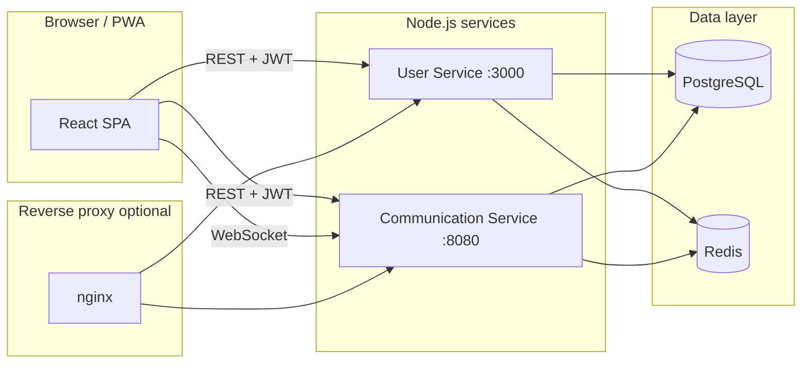

# Skill X Change

**A full-stack platform for peer-to-peer skill exchange** — users list what they can teach and what they want to learn, discover complementary people, chat in real time, and schedule structured exchange sessions. Built as a **microservices-style backend** with a **React (TypeScript)** client, **PostgreSQL**, **Redis**, and **Socket.IO**.

---

## Elevator pitch (for recruiters & reviewers)

Most learning products are **paywalled marketplaces**. Skill X Change explores the opposite idea: **matching people who can teach each other** and supporting the whole loop — **profile → discovery → messaging → scheduled session → reputation signals** — without selling courses as the center of gravity.

This repository shows **production-lean patterns**: separate services for domain boundaries, Prisma ORM, JWT auth, raw SQL for explainable recommendation scoring, caching, Dockerized deployment paths, and a mobile-friendly PWA-capable SPA.

---

## Live demo

| Environment        | URL |
|--------------------|-----|
| Frontend (example) | [skill-x-change-frontend.vercel.app/dashboard](https://skill-x-change-frontend.vercel.app) |

*Backend URLs depend on your deployment; the app is configured via environment variables (see each package’s `.env` / `env.example` patterns).*

---

## What’s implemented

| Area | Capabilities |
|------|----------------|
| **Identity** | Email signup, JWT access/refresh, Google OAuth flows, logout |
| **Profiles** | User details, avatar upload (**Cloudinary**), teach/learn skills (**Prisma** + normalized skill catalog) |
| **Discovery** | Search users by name, skill, profession |
| **Matching** | Server-side **skill-overlap scoring** (SQL), **Redis**-cached recommendations |
| **Messaging** | Conversations, text messages, **Socket.IO** real-time delivery, typing/read-oriented events |
| **Sessions** | Create/list skill-exchange sessions with statuses (pending, accepted, rejected, completed, cancelled), optional meeting links |
| **Trust signals** | Ratings / session ratings (schema & APIs in user service) |
| **Client UX** | Dashboard, Discover, Matches, Messages, Sessions, My Skills, Settings, **PWA** (Vite PWA plugin) |

**Roadmap-style ideas** (not claimed as fully shipped in this README): LLM-based matching, in-app video/WebRTC, on-chain reputation. The codebase includes hooks such as message types reserved for future signaling where appropriate.

---

## Architecture



- **User Service** — Auth, profiles, skills, search, recommendations, sessions, ratings, community highlights.
- **Communication Service** — Conversations, messages, notifications, Socket.IO gateway (JWT validated).
- **Two logical databases** on PostgreSQL — `skillxchange` (users/domain) and `skillxchange_chat` (chat), provisioned together in Docker via init scripts under `deploy/aws/postgres/`.

---

## Repository layout

```
SkillXChange/
├── SkillXChange-Frontend/          # React 18 + TypeScript + Vite + Tailwind
├── SkillXChange-Backend/
│   ├── SkillXChange-User-Service/
│   └── SkillXChange-Communication-Service/
└── deploy/aws/                   # Dockerfiles, docker-compose, nginx for EC2-style deploy
```

---

## Tech stack

### Frontend (`SkillXChange-Frontend`)

| Technology | Role |
|------------|------|
| **React 18** | UI |
| **TypeScript** | Type safety |
| **Vite** | Build tool & dev server |
| **Tailwind CSS** | Styling |
| **React Router** | SPA routing |
| **Axios** | HTTP client |
| **Socket.IO client** | Real-time chat |
| **react-hook-form** | Forms |
| **Framer Motion** | Motion/interaction |
| **@react-oauth/google** | Google sign-in |
| **Firebase** | Project-specific integrations |
| **vite-plugin-pwa** | Progressive web app |

### User Service (`SkillXChange-User-Service`)

| Technology | Role |
|------------|------|
| **Node.js + Express 5** | HTTP API |
| **Prisma** | ORM, migrations, PostgreSQL |
| **PostgreSQL** | Primary data store |
| **Redis** | Recommendation cache, etc. |
| **JWT** | Stateless auth |
| **bcryptjs** | Password hashing |
| **Joi** | Request validation |
| **Helmet, compression, CORS** | Hardening & performance |
| **Multer + Cloudinary** | Image uploads |
| **Nodemailer** | Optional transactional email |
| **Google Auth Library** | OAuth verification |

### Communication Service (`SkillXChange-Communication-Service`)

| Technology | Role |
|------------|------|
| **Node.js + Express** | REST API |
| **Socket.IO** | WebSockets |
| **Prisma + PostgreSQL** | Chat persistence |
| **Redis** | Caching / coordination |
| **JWT** | Securing HTTP + socket handshake |

### DevOps / deployment (`deploy/aws`)

| Technology | Role |
|------------|------|
| **Docker Compose** | Postgres, Redis, both services, nginx |
| **nginx** | Reverse proxy (`/api`, WebSocket upgrades) |
| **PostgreSQL 16** | Shared instance, two databases |

---

## How matching works (high level)

Recommendations are **transparent and deterministic**: the backend scores other users by **how many of your “learn” skills they teach** and **how many of your “teach” skills they want to learn**, plus search relevance when applicable. Results are **cached in Redis** to keep the dashboard snappy. This is **not** an opaque ML model — which is intentional for debuggability and trust in early product stages.

---

## Local development (summary)

Each subproject is runnable on its own; you typically need **PostgreSQL**, **Redis**, and matching `.env` files.

1. **User Service** — `SkillXChange-Backend/SkillXChange-User-Service/`  
   - Install deps, configure `DATABASE_URL`, `REDIS_*`, `JWT_SECRET`, optional Cloudinary/Google/email.  
   - `npx prisma migrate deploy` (or dev workflow), then `npm run dev`.

2. **Communication Service** — `SkillXChange-Backend/SkillXChange-Communication-Service/`  
   - Own `DATABASE_URL` pointing at the **chat** database, same `JWT_SECRET` as user service, Redis.  
   - Prisma migrate, then `npm run dev`.

3. **Frontend** — `SkillXChange-Frontend/`  
   - Point API base URLs at your local or deployed services via `.env`.  
   - `npm install && npm run dev`.

For an **all-in-one** production-shaped stack, see `deploy/aws/docker-compose.yml` and `deploy/aws/env.example`.

---

## Suggested GitHub repository topics

Copy into **Repository → About → Topics** to improve discoverability:

```
skill-exchange
peer-learning
social-learning
edtech
full-stack
react
typescript
vite
tailwindcss
nodejs
express
microservices
rest-api
postgresql
prisma
redis
socket-io
real-time-chat
jwt
oauth
google-oauth
docker
nginx
aws
pwa
```

---

## Author

**Lakshya Kumar Singh** — product and engineering focused on **community-driven learning** and **ethical, transparent matching** (not paywalled content as the default).

---

## License

Specify in-repo if you add a `LICENSE` file; subpackages currently list their own `license` fields in `package.json` where present.
